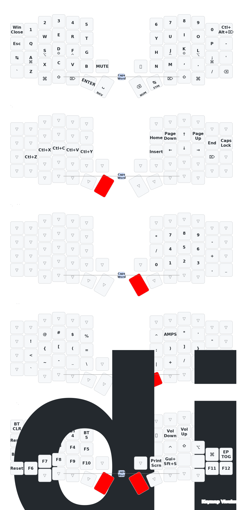
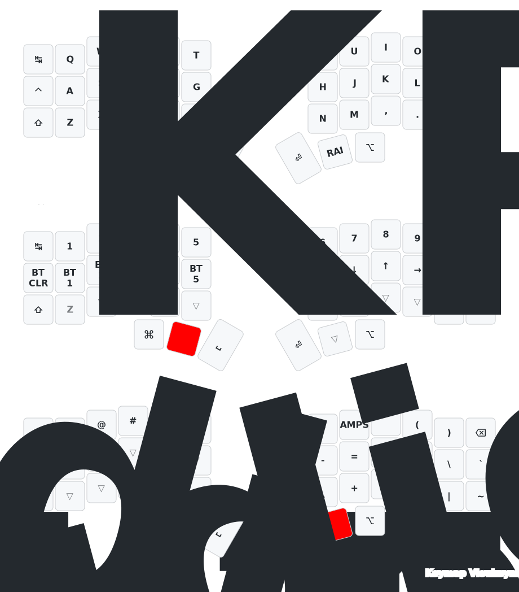
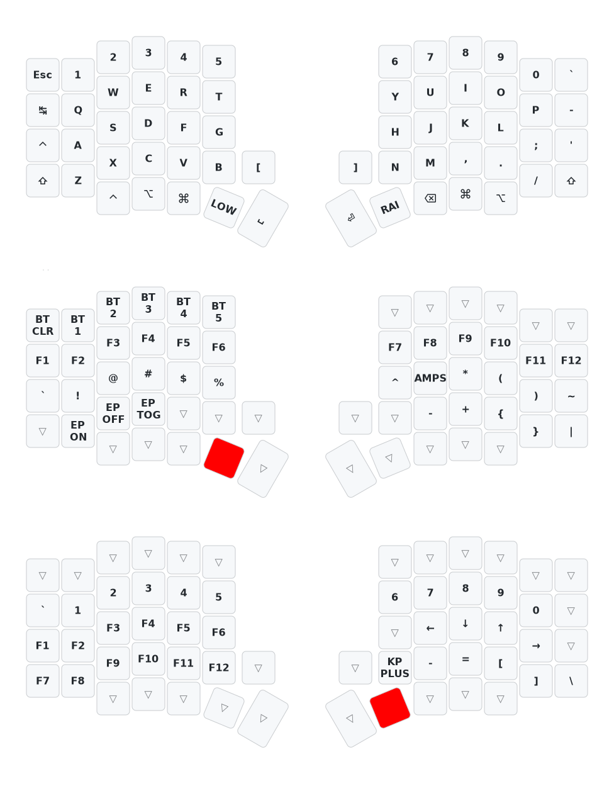

# đây là file tổng hợp. Hỗ trợ dongle rời dành cho máy tính không có card bluetooh

Firmware builds for three ZMK boards (Corne, Sofle, splitkb Aurora Sofle), all wired through a
shared dongle receiver so the host machine doesn't need onboard Bluetooth. Every push to `main`
builds all board/shield combinations and publishes the `.uf2` files to the
[`latest` release](../../releases/tag/latest) — no GitHub login required to download.

## Keymaps

These diagrams are regenerated by CI from `config/*.keymap` on every push to `main` and committed
back automatically, so they always match what's actually being built — no manual re-export step.

### Sofle

### Corne

### splitkb Aurora Sofle

